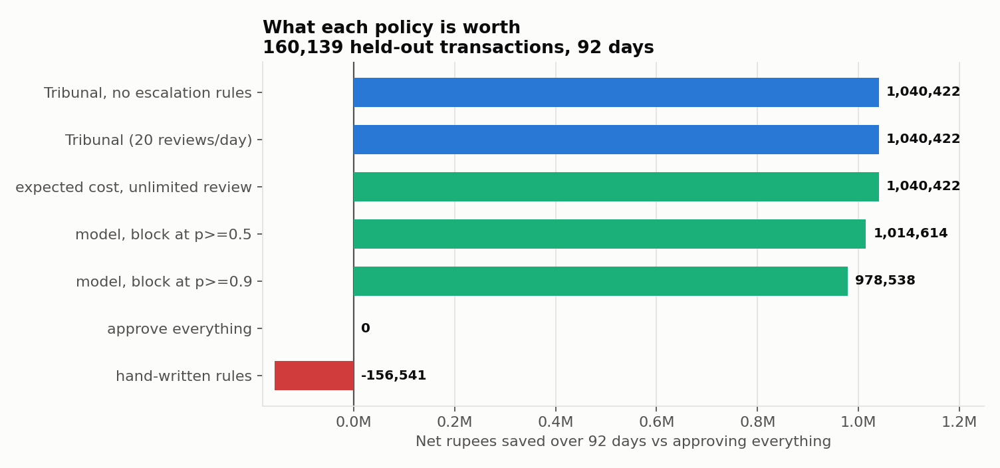
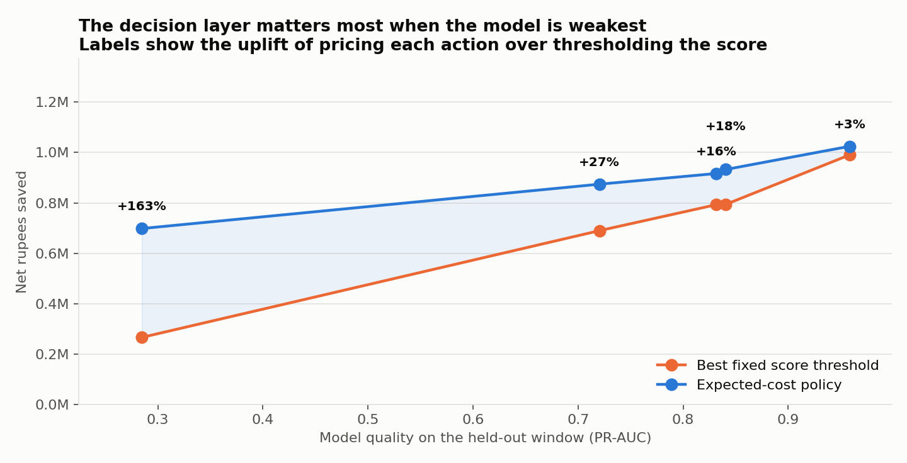
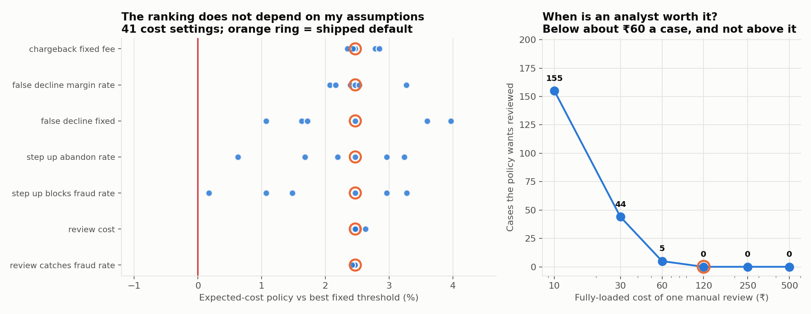
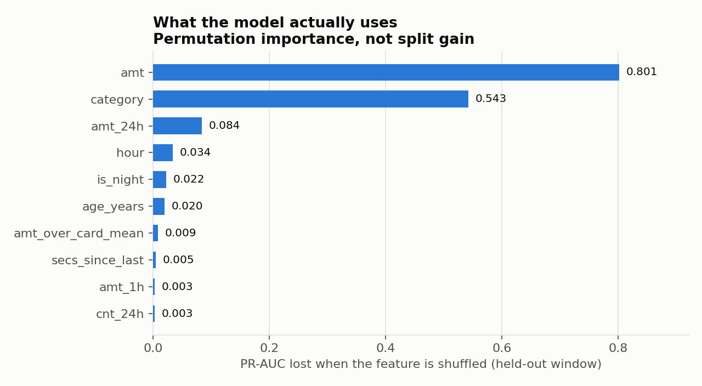
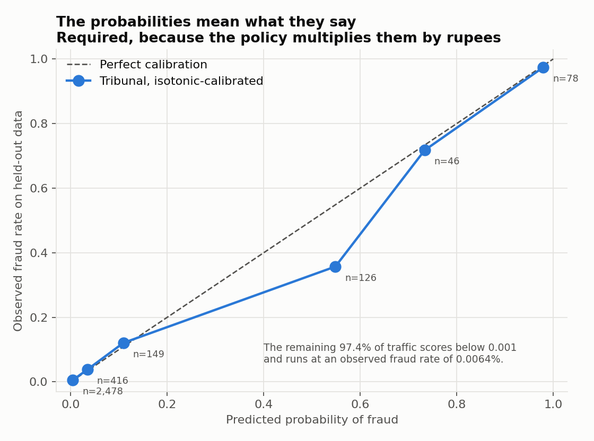

# Tribunal

**Fraud triage that writes down why.**

Every decline gets a reason. Every reason gets a receipt.

Razorpay AI Buildathon 2026 — AI Risk Manager track.

---

## The problem I actually went after

Most fraud projects stop at a classifier: a score, a threshold, an AUC. Real risk
teams do not have that problem. They have four problems the classifier does not
touch:

1. **A score is not a decision.** Declining a ₹200 transaction and declining a
   ₹90,000 transaction at the same score is not the same bet. The threshold that is
   right for one is wrong for the other.
2. **Blocking good customers costs money too**, and it never shows up in a
   precision number. A policy can improve recall and destroy the business.
3. **Manual review is a fixed number of people**, not an unbounded bucket. A policy
   that sends 4% of traffic to a queue that holds 0.1% is not a policy.
4. **Somebody will ask why**, later — a merchant, a cardholder, a regulator. "The
   model said 0.83" is not an answer.

Tribunal is built around those four, not around the score.

---

## Headline result

Held-out window: **160,139 transactions over 92 days**, containing 1,055 fraudulent
transactions worth ₹560,519. The model never saw this window; neither did any
feature.

| Policy | Net saved | Fraud value stopped | Good customers touched | Friction inflicted |
|---|---:|---:|---:|---:|
| Approve everything | ₹0 | 0% | 0 | ₹0 |
| Hand-written rules | **−₹156,541** | 81.2% | 3,607 | ₹836,913 |
| Model, block at p ≥ 0.5 | ₹1,014,614 | 97.1% | 63 | ₹20,810 |
| **Tribunal** | **₹1,040,422** | **99.3%** | 365 | **₹16,844** |
| Decline everything | −₹40,330,808 | 100% | 159,084 | ₹40.3M |



Two things in that table are worth more than the headline number.

**The hand-written rules lose money.** Not "underperform" — they are worse than
doing nothing at all, by ₹156,541. They catch 81% of fraud value and pay for it by
declining 3,607 legitimate customers. This is the system a team has before it has a
model, and it is a negative asset.

**Tribunal touches 5.8× more good customers than the plain threshold and inflicts
19% *less* friction on them** (₹16,844 vs ₹20,810). That is the whole argument for
the design in one row: it is not choosing *whether* to intervene, it is choosing
*how*. Most of its extra interventions are step-up challenges — an OTP, not a
decline — which cost a good customer very little and stop a fraudster who does not
have the phone. Precision drops to 0.74 from 0.94, and that is the correct trade,
because precision counts interventions and the business pays in rupees.

---

## Is the rest of the system worth its complexity? Sometimes not, and here is where.

The honest answer on this benchmark: **the expected-cost policy is worth 2.5% over
a plain threshold, and the review queue is never used at all.** The model is so
accurate here (PR-AUC 0.968) that almost every transaction is obviously fine or
obviously fraud, so paying an analyst ₹120 to look at one is never the cheapest
action.

That is a fact about the *simulator*, not about fraud. So I measured where the
decision layer starts to matter, by building a ladder of genuinely weaker models
(restricted feature sets, each honestly recalibrated) and re-running every policy
against each.



| Model quality (PR-AUC) | Best fixed threshold | Expected-cost policy | Uplift |
|---:|---:|---:|---:|
| 0.285 | ₹265,927 | ₹698,217 | **+163%** |
| 0.720 | ₹689,738 | ₹874,284 | +27% |
| 0.831 | ₹792,726 | ₹916,619 | +16% |
| 0.840 | ₹793,527 | ₹932,449 | +18% |
| 0.959 | ₹990,881 | ₹1,024,879 | +3% |

The weaker the model, the more the decision layer is worth — because uncertainty is
exactly when *what you do about a score* starts to matter more than the score.
Production card-fraud models do not operate at 0.97. This benchmark is the regime
where Tribunal's architecture matters least, and it still wins.

---

## How much of this rests on cost numbers I made up?

Every constant in `tribunal/economics.py` is an assumption. None was measured from
a real payments business, because I do not have one. That is the biggest weakness
in the rupee figures above, so rather than caveat it in a sentence I measured it:
each parameter swept across a plausible range while the others hold, **41 settings
across 7 parameters**, re-running both policies at every point.

The fixed-threshold baseline is given an unfair advantage throughout — its cutoff
is tuned on the very window it is scored on. If the expected-cost policy still
wins, tuning cannot explain it.



**The ranking never flips.** The expected-cost policy wins at all 41 settings. The
margin ranges from **+3.97%** (when a false decline costs ₹1,000 in fixed
relationship damage) down to **+0.17%** — that floor is the case where step-up
authentication only stops half of fraudsters, which strips the policy of the
friction ladder that is most of its advantage. So the conclusion is robust, but its
*size* depends most on how well your OTP challenge actually works, which is a thing
a real business can measure.

**And it answers the awkward question.** The review queue sits unused not because
the machinery is broken but because an analyst costs more than the uncertainty is
worth. Sweeping that cost gives a capacity-planning answer rather than an excuse:

| Fully-loaded cost per review | Cases the policy wants reviewed |
|---:|---:|
| ₹10 | 155 |
| ₹30 | 44 |
| ₹60 | 5 |
| **₹120 (assumed)** | **0** |
| ₹250 | 0 |

Manual review pays for itself on this traffic only below roughly **₹60 a case**.
Review also becomes attractive when step-up is unreliable — if OTP challenges only
stop 50% of fraud, the policy starts asking for 30 human reviews, because the cheap
intervention is no longer trustworthy. Both are the system correctly declining to
spend money it cannot justify.

---

## Things I found that I did not want to find

This section exists because a result with no failures in it has not been looked at
hard enough.

### 1. My second most important feature was learning the opposite of reality

Permutation importance put `card_fraud_rate_sm` — the card's own prior
confirmed-fraud rate — second, worth **0.30 PR-AUC**. Then I checked its direction:

| Quintile of card's prior confirmed-fraud rate | Subsequent fraud rate |
|---|---:|
| Lowest | 2.938% |
| 2nd | 0.000% |
| 3rd | 0.356% |
| 4th | 0.000% |
| Highest | 0.000% |

Single-feature ROC-AUC: **0.102**. Strongly predictive, with the sign reversed. In
this simulator a card is defrauded at most once, so "has been defrauded before"
means "is now safe." In production the opposite is true: a card with a confirmed
compromise belongs to a targeted customer and is at *elevated* risk.

I deleted the feature. It cost 0.021 PR-AUC and ₹21,553 on the benchmark. That is
the correct price for not shipping a model that under-protects exactly the customers
who have already been harmed once.



### 2. Geolocation is noise in this dataset, so it does not get a vote

Impossible-travel detection is one of the strongest signals in real card-present
fraud, and I built it. Then I measured it:

- Distance from the cardholder's home region: **ROC-AUC 0.494** against the label.
- Median implied travel speed: 4,011 km/h for legitimate transactions,
  3,462 km/h for fraud.

The simulator draws merchant coordinates from a fixed radius around each customer,
independently of whether the transaction is fraud, and scatters consecutive
merchants at random. The check still runs and still reports what it sees, but it is
barred from escalating a decision (`GEO_IS_DIAGNOSTIC = False`), because on this
data a geo rule can only manufacture false positives. On real data you would flip
that flag and re-measure.

### 3. The escalation rules add nothing here

I built deterministic escalation rules on top of the cost model, then measured them.
On this benchmark they change the outcome by **₹0** — the cost model already reaches
the same decisions. They are kept, off the critical path, because the sweep shows
they matter at lower model quality; but "we added rules and they helped" would have
been a claim, not a finding. The evaluation reports Tribunal with and without them
side by side.

### 4. A dataset defect that would have invalidated everything

My first dataset came from the fraud simulator's current master branch. Its
parallelised generator walks spend categories sequentially through the simulated
calendar instead of sampling per transaction, so every customer transacts in the
same category at the same time: `gas_transport` appeared only in Jan–Apr 2023,
`travel` only in Jun 2024, and in the training window `personal_care` contained 137
transactions of which **137 were fraud**.

Under a temporal split that makes `category` a proxy for "which month is this."
Everything downstream would have been meaningless. The whole dataset is regenerated
from the generator's v0.5 branch, which does not have the defect — category shares
are flat at ~1/14 in every month. `scripts/generate_data.sh` documents this.

### 5. A timestamp bug that made the model look *better*

Features were built with `astype("int64") // 10**9` on a pandas datetime column.
pandas 3.0 stores datetimes at microsecond resolution, so that compressed 18 months
into 47 seconds: every velocity window covered the entire dataset, and `cnt_24h`
equalled `cnt_7d` on every row. The model's AUC went *up*, because the broken
features were harmless and the remaining ones carried the signal.

Nothing alerted. I found it by plotting feature distributions and noticing two
columns were identical. `tests/test_features.py::test_window_boundaries` is the
regression test.

### Where it still fails

- **38 fraudulent transactions worth ₹3,770 get through** (3.6% of fraud by count).
  They are small and unremarkable: median amount well inside the cardholder's normal
  range, at familiar merchants, during normal hours. No check fires and the model
  scores them low. Catching them at this cost model's thresholds would cost more in
  false declines than the fraud is worth — which is the system working as designed,
  not a bug, but it is a real limit.
- **365 legitimate customers are challenged or declined.** The memos show most are
  large first-time purchases at unfamiliar merchants — genuinely ambiguous.
- **Calibration is under-confident in the middle band**: transactions scored ~0.55
  come in at ~0.36 observed (n=126). Small samples, but it biases the policy toward
  over-intervening in exactly the ambiguous range.
- **The absolute rupee figures are not a forecast.** They follow from a cost model
  whose parameters are stated assumptions (`tribunal/economics.py`), and from a
  simulated dataset. The *ranking* of policies survives all 41 settings tested
  above; the totals move a lot and should not be quoted as a projection.



---

## How it works

```
transaction
    │
    ├─▶ FeatureEngine.compute()        29 point-in-time features
    │        strictly past-only; label-derived features delayed 7 days
    │
    ├─▶ 6 deterministic checks         velocity · geo · spend profile
    │        each returns Evidence:     merchant risk · novelty · temporal
    │        what it saw, how alarming,
    │        one sentence a human reads
    │
    ├─▶ calibrated model               HistGradientBoosting + isotonic
    │        returns a probability that means what it says
    │
    ├─▶ policy                         expected cost of allow / step-up /
    │        argmin over four actions,  review / block, in rupees
    │        subject to review capacity
    │
    ├─▶ memo                           written from the evidence that fired
    │
    └─▶ audit                          hash-chained, append-only
```

**There is no language model in this loop.** That is deliberate. The orchestration
is a fixed set of tools run in a fixed order and combined by an explicit cost
calculation, because this code sits in the authorisation path of a payment:

- it decides in **55 µs at p50, 106 µs at p99**, not hundreds of milliseconds;
- it is **reproducible** — same transaction, same state, same decision — which is
  what makes the audit trail worth having and a regression test possible;
- it is cheap enough to run on **100% of traffic**, not a sampled slice.

The language model earns its place where a human would otherwise be writing prose:
rewriting evidence into a case note for the ~0.1% of transactions that reach an
analyst. That is `memo.py`, off the hot path, and it falls back to deterministic
templates when unavailable — a memo service outage must never affect a payment
decision.

Full reasoning in [ARCHITECTURE.md](ARCHITECTURE.md).

---

## Point-in-time features, and what that discipline costs

The single easiest way to make a fraud model look brilliant is target leakage:
compute a card's average spend or a merchant's fraud rate with one `groupby` over
the whole dataset, and score transactions with information from their own future.
The code looks completely normal.

`tribunal/features.py` makes it impossible by construction — state is built by
streaming in timestamp order, `compute()` sees only what came before, `observe()`
folds the transaction in afterwards. It also models something usually ignored:
**labels arrive late**. You do not know a transaction was fraud at authorisation;
you find out when it is disputed. Every label-derived feature is therefore delayed
by a 7-day dispute window.

Measured cost of the shortcuts I refused (`eval/leakage_ablation.py`):

| Protocol | PR-AUC (full features) | PR-AUC (weak features) |
|---|---:|---:|
| Honest — temporal split, point-in-time | 0.9313 | 0.8979 |
| Leaky aggregates, temporal split | 0.9421 | 0.9072 |
| Random split + leaky aggregates | 0.9674 | 0.9348 |

Leakage inflates PR-AUC by **~4% relative** in both regimes. Smaller than I
expected, and I am reporting it rather than burying it: on this benchmark the
honest model is already near the ceiling, so there is little room left to flatter
it. The discipline is still the difference between a number you can trust and one
you cannot.

---

## The audit trail

Every intervention, and a sample of approvals, is written to an append-only JSONL
log where each record carries the SHA-256 of the one before it. Editing or deleting
any past decision breaks every hash after it, and `verify()` reports the exact index
where the chain first fails.

```
$ python -c "from tribunal.audit import verify; print(verify('artifacts/audit.jsonl'))"
(True, None, 'chain intact across 1,699 records, head e13b21d1d7afb23d')
```

Card numbers are masked before they are written. This is tamper-*evident*, not
tamper-proof — anyone who can rewrite the whole file can rewrite the chain; making
it tamper-proof needs an external anchor, and publishing the head hash somewhere you
do not control is the cheap version. What it does prevent is the failure mode that
actually happens: a decision quietly changed in place after someone asks about it.

A real memo, generated from real evidence:

```
Challenged with an additional authentication factor: 633 at Rodriguez, Yost and
Jenkins (misc_net).
Model probability of fraud 4.65%. Expected cost of this action 40, versus 53 if
approved outright.

Evidence:
  - [novelty] First-time merchant never used by this card.
  - [model] Model puts fraud probability at 4.65% - top 1% of scored traffic.

Checks that did not fire: velocity, geo, spend_profile, merchant_risk, temporal.
```

Note the last line. The checks that *stayed silent* are recorded too, because "we
looked and found nothing" and "we never looked" are different answers to a
regulator.

---

## Running it

```bash
pip install -r requirements.txt

bash scripts/generate_data.sh 700          # ~2 min   (v0.5 branch — see the script)
python scripts/build_dataset.py            # ~30 s
python scripts/build_features.py           # ~20 s    917,792 rows, point-in-time
python scripts/train_model.py              # ~30 s
python scripts/demo_run.py                 # ~60 s    audit log + memos + latency
python eval/run_eval.py                    # ~90 s    the headline table
python eval/uncertainty_sweep.py           # ~4 min
python eval/leakage_ablation.py            # ~4 min
python eval/importance.py                  # ~3 min
python eval/sensitivity.py                 # ~40 s     41 cost settings
python scripts/make_charts.py

pytest tests/ -q                           # 28 tests
```

Serve it:

```bash
uvicorn api.main:app --reload
curl -X POST localhost:8000/decide -H 'Content-Type: application/json' -d '{
  "cc_num":"4532015112830366","amt":8400,"merchant":"Kutch and Sons",
  "category":"shopping_net","lat":19.07,"long":72.87,
  "merch_lat":19.21,"merch_long":72.85,"city_pop":12442373,"age_years":29
}'
curl localhost:8000/audit/verify
```

Everything is reproducible from a seed. There is no notebook.

---

## Performance

| | |
|---|---:|
| Transactions processed end-to-end | 917,792 |
| Wall clock | 54.3 s |
| Throughput | 16,904 /s |
| Decision latency (features + 6 checks + policy + memo + audit) | p50 55 µs · p99 106 µs |
| End-to-end incl. one-row model inference | p50 7.9 ms |

The second number is honest and worth explaining rather than hiding: scoring a
single row through scikit-learn carries a fixed per-call overhead that dominates
everything else. A real deployment amortises it with batching or a compiled model
server; the *system's own* work is the 55 µs. Reporting only the fast number would
be dishonest; reporting only the slow one would misattribute where the cost is.

---

## Data

Generated with the open-source [Sparkov
simulator](https://github.com/namebrandon/Sparkov_Data_Generation) (**v0.5 branch** —
see failure #4 above), seed 4444: 917,792 transactions, 698 cards, 693 merchants,
Jan 2023 – Jun 2024, 6,746 fraudulent (0.735%). Split temporally: train through
2024-01-31, calibrate through 2024-03-31, test on the remaining 92 days.

It is simulated, and its fraud is more separable than real fraud — high amounts,
concentrated at night. Every absolute number here should be read as an upper bound.
The comparisons between policies, which is what the project is actually about, are
run on identical data and identical features and are not affected by that.

Currency: the benchmark's `amt` column is US-shaped; one amount unit is treated as
one rupee throughout. Rupee totals scale with that choice; policy rankings do not.

## Layout

```
tribunal/
  features.py      point-in-time feature engine, delayed labels
  economics.py     the cost model — every assumption in one file
  policy.py        expected-cost decision + review budget controller
  agent.py         the pipeline
  memo.py          case memos (templates; optional LLM rewrite)
  audit.py         hash-chained append-only log
  tools/           the six checks + the model, behind one Evidence interface
eval/              policies, headline eval, model-quality sweep,
                   leakage ablation, permutation importance, cost sensitivity
scripts/           data generation, feature build, training, demo run, charts
api/               FastAPI decision service
tests/             35 tests
reports/           generated metrics and figures
```
